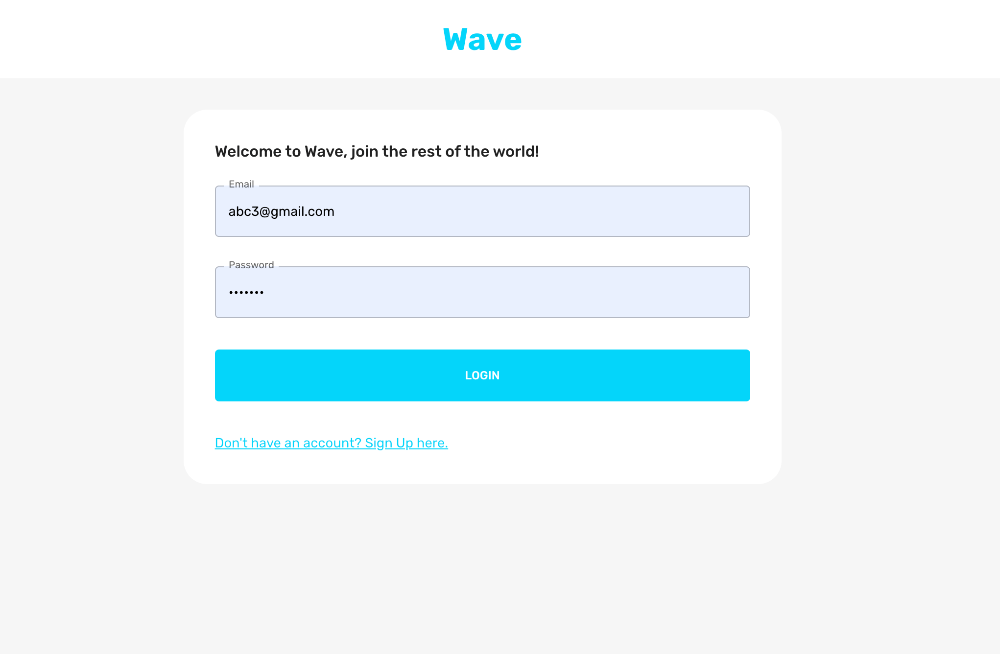
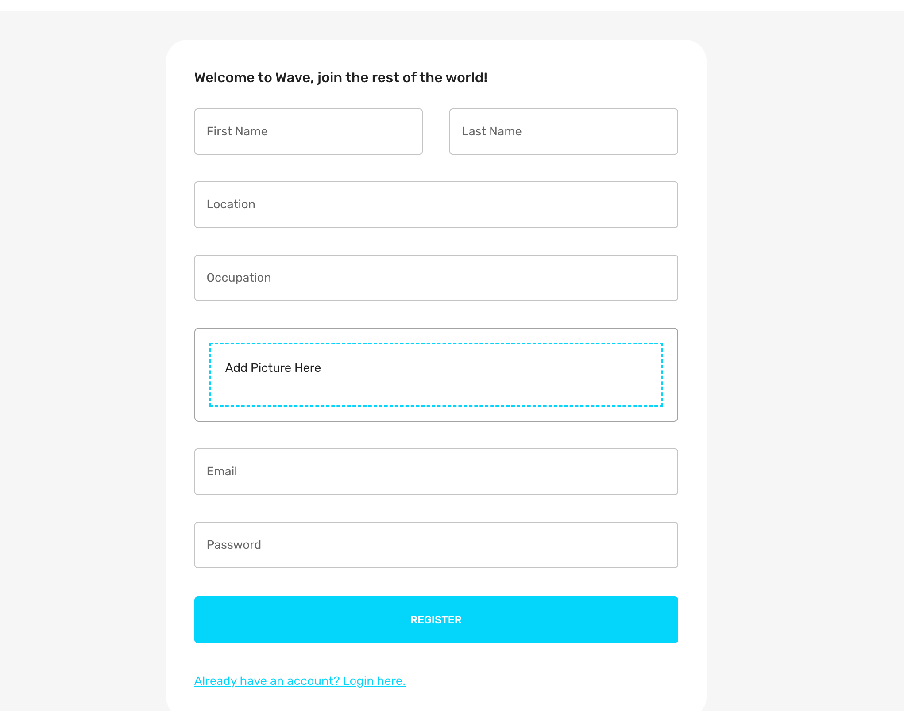

# Wave Social Media App

## Overview
Wave is a MERN stack social media app that provides a platform for users to connect, share posts, and interact with each other. The app includes features such as user authentication, posting content, liking posts and comments, adding friends, dark mode, and CORS protection.

## Features

### User Authentication
- Secure account creation and login.
- Implementation of JSON Web Tokens (JWT) for secure user authentication.

### Posting Content
- Users can create and share posts with text and media.

### Interactions
- Users can like and comment on posts.
- Post likes are tracked, and users can view the total number of likes.

### Friendship
- Users can send and receive friend requests.
- Accepted friends are displayed on the user's profile.

### Dark Mode
- The app features a dark mode for users who prefer a darker color scheme.

### CORS Protection
- Implementation of Cross-Origin Resource Sharing (CORS) for controlled resource access and enhanced security.

## Security Features

### Authentication
- JWT (JSON Web Tokens) are implemented for secure user authentication.

### Helmet Middleware
- Helmet is used to enhance app security by setting various HTTP headers.

### CORS Protection
- Cross-Origin Resource Sharing (CORS) is implemented to control access to resources and enhance security.

## Tech Stack

### Frontend
- React
- Material-UI

### Backend
- Node.js
- Express

### Database
- MongoDB
